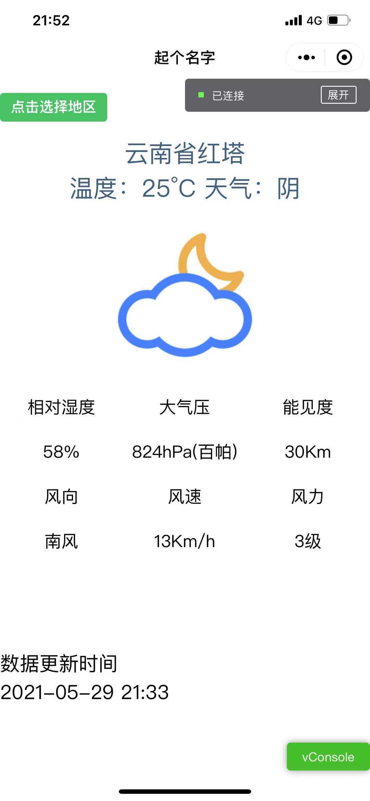

### 微信小程序利用和风天气webapi获取天气信息
#### 用到的网站
+ 城市信息查询 https://dev.qweather.com/docs/api/geo/city-lookup/
+ 实时天气查询 https://dev.qweather.com/docs/api/weather/weather-now/

#### 截图

#### 需要注意的地方
+ 需要在微信开发平台添加配置服务器域名
+ key换成自己的
+ 测试不算严谨，仅可用作学习参考。
+ 本人才学疏浅，如有提议可以在issues提或者pull request.
